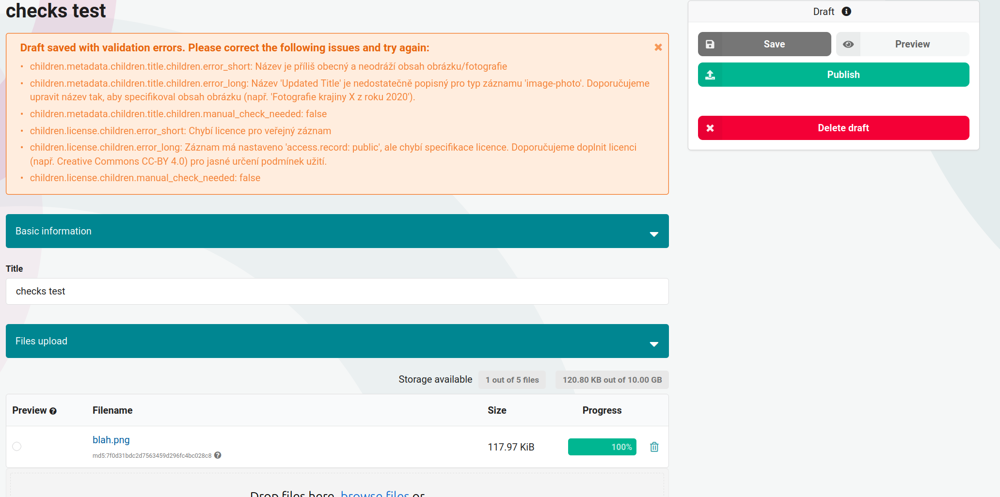

# Prerequisites

1. Running repository instance
2. OARepo Checks library installed
3. Access to an LLM API (e.g., chat.ai.e-infra.cz) or a custom LLM client
4. Model preset configured in your repository model

# Overview

The OARepo Checks library provides LLM-powered validation for Invenio records. When users create or update records/drafts, the system can automatically validate the metadata using a Large Language Model and provide structured feedback about potential errors or improvements.

# High-Level Flow

When a user saves a draft, the following occurs:

1. The OARepoChecksComponent intercepts the save operation
2. Record metadata is serialized to JSON
3. A validation prompt is generated (optionally using Jinja2 templates)
4. The prompt and record data are sent to the configured LLM client
5. The LLM analyzes the record and returns structured validation results
6. Validation errors are stored in the checks system
7. The UI displays validation results to the user (e.g., "Draft saved with validation errors")

# Configuration

## Repository Model Setup

Add the `check_preset` to your model definition:

```python
from oarepo_checks.model.presets import check_preset
from oarepo_model.api import model

datasets_model = model(
    "datasets",
    version="1.1.0",
    presets=[check_preset, other_presets...],
    types=[],
    metadata_type="YourMetadataType",
)
```

The `check_preset` automatically configures the OARepoChecksComponent in your service.

## Enable Checks Feature (invenio.cfg)

Enable the checks feature in your `invenio.cfg`:

```python
# Enable the checks feature
CHECKS_ENABLED = True

# Required: Enable UI blueprint registration to prevent service crashes
# The checks component searches for the generic community record via service,
# which expands links. This was causing crashes when Invenio added HTML links
# to link templates. This should be fixed in a future version.
COMMUNITIES_REGISTER_UI_BLUEPRINT = True
```

## LLM Client Configuration

### Using the Built-in ChatEInfraClient

For production use with the e-INFRA CZ API:

```python
from oarepo_checks.llm_client import ChatEInfraClient

# Configure LLM client(s)
OAREPO_CHECKS_LLM_CLIENTS = {
    "chat_einfra": ChatEInfraClient(
        api_token="your-api-token-here",
        api_url="https://chat.ai.e-infra.cz/api/chat/completions",  # optional, this is the default
        model="deepseek-r1"  # optional, this is the default
    )
}

# Set the default client to use
OAREPO_CHECKS_DEFAULT_LLM_CLIENT = "chat_einfra"
```

### Creating a Custom Dummy Client for Testing

For development and testing without external API calls:

```python
from oarepo_checks.llm_client import BaseLLMClient

class DummyClient(BaseLLMClient):
    """Dummy LLM client for testing purposes."""

    def chat_completion(
        self,
        prompt: str,
        **kwargs,
    ) -> str:
        """Return hardcoded validation results for testing."""
        return """{
    "metadata.title": {
        "section_empty": false,
        "errors": [
            {
                "error_short": "Title is too generic",
                "error_long": "The title 'Updated Title' does not adequately describe the content. Consider providing more specific details about the dataset.",
                "manual_check_needed": false
            }
        ]
    },
    "metadata.license": {
        "section_empty": false,
        "errors": [
            {
                "error_short": "Missing license for public record",
                "error_long": "The record is set to 'access.record: public', but no license is specified. Please add a license (e.g., Creative Commons CC-BY 4.0) to clarify usage terms.",
                "manual_check_needed": false
            }
        ]
    },
    "metadata.description": {
        "section_empty": true,
        "errors": []
    }
}"""

# Configure the dummy client
OAREPO_CHECKS_LLM_CLIENTS = {"dummy": DummyClient()}

# Set the default client to use
OAREPO_CHECKS_DEFAULT_LLM_CLIENT = "dummy"
```

### Creating a Custom LLM Client

You can create your own LLM client for other APIs:

```python
from oarepo_checks.llm_client import BaseLLMClient
import requests

class CustomLLMClient(BaseLLMClient):
    """Custom LLM client for your API."""

    def __init__(self, api_key: str, endpoint: str):
        self.api_key = api_key
        self.endpoint = endpoint

    def chat_completion(self, prompt: str, **kwargs) -> str:
        """
        Send a prompt to your LLM API and return JSON response.

        The response must be valid JSON with the structure:
        {
            "field.path": {
                "section_empty": bool,
                "errors": [
                    {
                        "error_short": str,
                        "error_long": str,
                        "manual_check_needed": bool
                    }
                ]
            }
        }
        """
        headers = {"Authorization": f"Bearer {self.api_key}"}
        response = requests.post(
            self.endpoint,
            json={"prompt": prompt},
            headers=headers
        )
        response.raise_for_status()
        return response.json()["result"]

# Register in configuration
OAREPO_CHECKS_LLM_CLIENTS = {
    "custom": CustomLLMClient(
        api_key="your-api-key",
        endpoint="https://your-llm-api.com/chat"
    )
}

OAREPO_CHECKS_DEFAULT_LLM_CLIENT = "custom"
```

# Expected LLM Response Format

The LLM client must return a JSON string with the following structure:

```json
{
  "metadata.title": {
    "section_empty": false,
    "errors": [
      {
        "error_short": "Brief error description",
        "error_long": "Detailed explanation and suggestions for fixing the issue",
        "manual_check_needed": false
      }
    ]
  },
  "metadata.license": {
    "section_empty": true,
    "errors": []
  }
}
```

**Field Descriptions:**

- `section_empty`: Set to `false` if errors were found, `true` if the section was checked but no errors were found
- `errors`: Array of error objects
  - `error_short`: Brief, user-friendly error message
  - `error_long`: Detailed explanation with suggestions for resolution
  - `manual_check_needed`: Flag indicating if manual review is required (optional, can be used for future features)

# Testing the Setup

## Visual Test with the UI

1. Start your repository instance
2. Navigate to the record creation/editing page
3. Fill in some metadata fields
4. Save the draft
5. If validation errors are detected, you should see a notification indicating "Draft saved with validation errors"
6. The errors panel should display the validation results as shown in the screenshot



## Testing with the Dummy Client

Using the `DummyClient` configuration above:

1. Configure the dummy client in `invenio.cfg`
2. Restart your repository instance
3. Create or edit a draft record
4. Save the draft
5. You should see the hardcoded validation errors displayed in the UI

This allows you to test the validation workflow without making actual API calls to an LLM service.

# Known Limitations and Future Improvements

## Current Limitations

1. **Synchronous Execution**: The LLM validation currently runs synchronously during the save operation. This means users must wait for the LLM API response before the save completes.

2. **No Retry Mechanism**: If the LLM API fails or times out, the validation will fail without retry attempts.

3. **Limited Error Handling**: Network issues or malformed LLM responses may not be handled gracefully.

4. **UI Blueprint Configuration Workaround**: Currently requires `COMMUNITIES_REGISTER_UI_BLUEPRINT = True` to prevent service crashes when the checks component searches for the generic community record. This occurs because the service expands links and Invenio adds HTML links to link templates, causing incompatibilities. This workaround should be properly fixed in a future version.

### Celery Task Integration

Ideally LLM check should be perfomed via celery task.

# Automatic Check Registration

## RegisterCheckComponent

The `RegisterCheckComponent` automatically creates and manages LLM check configurations when communities are created or updated. This means you don't need to manually configure checks for each community.

When a community is created:

- A `CheckConfig` for the LLM check is automatically created
- A validation prompt is generated using Jinja2 templates (can include community-specific rules)
- The check is enabled by default with severity set to `WARN`

When a community is updated:

- The validation prompt is regenerated to reflect any changes to community metadata

## Generic Community Checks

For records without an assigned community, the system uses a generic community for validation. This ensures that all records can be validated, even if they are not part of a specific community.

The generic community uses the slug `generic-community` by default. When a record without a community is validated:

1. The system looks for a `CheckConfig` associated with the generic community
2. Uses the generic community's validation prompt
3. Applies the same LLM validation process as community-specific records

You can configure the generic community slug in `invenio.cfg`:

```python
CHECKS_GENERIC_COMMUNITY = "generic-community"  # Default value
```

Make sure a community with this slug exists in your repository, or create check configurations for it using the CLI commands.

## Custom Validation Prompts

You can customize validation prompts using Jinja2 templates. See the [TEMPLATES.md](https://github.com/oarepo/oarepo-checks/blob/main/TEMPLATES.md) file in the oarepo-checks repository for details on creating custom prompt templates.

# CLI Commands

The library provides CLI commands for managing checks:

```bash
# Enable LLM check for a specific community
oarepo checks enable-llm-check <community-slug>

# Disable LLM check for a specific community
oarepo checks disable-llm-check <community-slug>

# Update prompts for all communities
oarepo checks update-prompts

# Update prompt for a specific community
oarepo checks update-prompts --community-slug <community-slug>
```

# Troubleshooting

## Validation Not Running

1. Verify `CHECKS_ENABLED = True` in `invenio.cfg`
2. Ensure `check_preset` is included in your model definition
3. Check that an LLM client is properly configured
4. Verify the default client is set correctly

## LLM API Errors

1. Check API token validity and permissions
2. Verify network connectivity to the LLM API endpoint
3. Review API rate limits and quotas
4. Check application logs for detailed error messages

## Invalid Response Format

1. Ensure the LLM client returns valid JSON
2. Verify the JSON structure matches the expected format
3. Check for markdown formatting in responses (the `ChatEInfraClient` automatically strips markdown code blocks)

# References

- [OARepo Checks GitHub Repository](https://github.com/oarepo/oarepo-checks)
- [Invenio Checks Documentation](https://github.com/inveniosoftware/invenio-checks)
- [e-INFRA CZ Chat API](https://chat.ai.e-infra.cz/)
